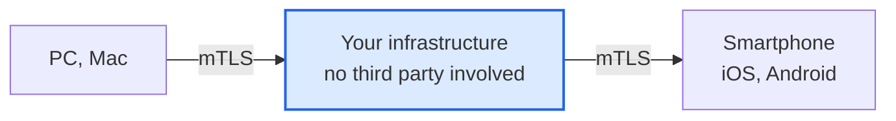
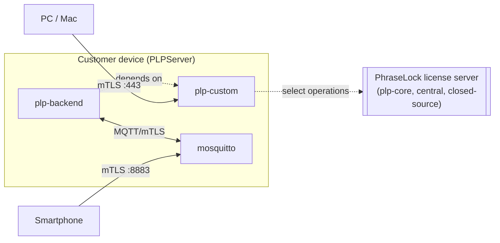

# PhraseLock - Your Login Wallet

Self-hosted backend for password managers. No third party ever sees your
data or credentials — everything runs on hardware you own.

## Why

Most password-manager backends are someone else's server. PhraseLock is a
set of components you deploy on your own infrastructure (a Raspberry Pi, a
VPS, whatever you already control), so the trust boundary stops at hardware
you physically or contractually own.

## Repositories

| Repo | What it is |
|---|---|
| [PhraseLock-Bridge](https://github.com/phraselock/PhraseLock-Bridge) | Native `install.sh` installers (whiptail-driven) that turn a bare Raspberry Pi/VPS into a running PhraseLock deployment — PKI, nginx, mosquitto, systemd units, no Docker. Start here if you want to run your own instance. |
| [plp-custom](https://github.com/phraselock/plp-custom) | The per-customer service deployed by `PLPServer` (via PhraseLock-Bridge) — issues bootstrap/MQTT client certs for that customer's devices and talks to the PhraseLock license server for select operations. `plp-backend` depends on it, since both run in the customer's own context. |
| [plp-backend](https://github.com/phraselock/plp-backend) | MQTT-connected service layer that talks to the actual password-manager backends (KeePass, Psono), toggled per deployment via `bes.keepass.enabled` / `bes.psono.enabled`. Runs alongside `plp-custom` on the customer's device. |

`plp-core`, the PhraseLock license server, is intentionally not part of this
list — it never runs at the customer's site and isn't open-sourced.

## Architecture at a glance

## Mobile apps

The PhraseLock companion app isn't distributed through GitHub — iOS and
Android don't allow that for regular users, so grab it from the official
stores instead:

<a class="qr-link-appstore pum-trigger" style="display: inline-block; padding-top: 14px; cursor: pointer;"> 
 
</a> 
<a class="qr-link-playstore pum-trigger" style="display: inline-block; cursor: pointer;"> 
 
</a>

## Getting started

To run your own PhraseLock backend, see
[PhraseLock-Bridge](https://github.com/phraselock/PhraseLock-Bridge) — it
packages everything above into guided installers, no manual PKI or config
editing required.

## License

<!-- TODO (Thomas): Lizenz/Kontakt ergänzen -->
