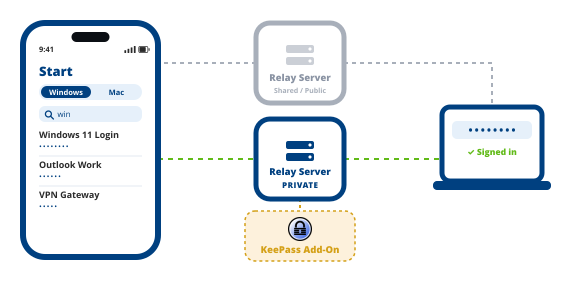

# PhraseLock-Bridge - Your Own Relay-Server

PhraseLock is a full service password and credential wallet with self-hosted backend and private communication channel. It gives you the utmost control over your credentials and how to apply them. Everything between your smartphone and your computer is pure open source.

## Architecture at a glance

PhraseLock works out of the box and you have the choice to use the public channel or to run your own infrastructure by installing PhraseLock-Bridge. If you want to use e.g. KeePass as a main source for your credentials, **PhraseLock-Bridge** is mandatory.

 

  

## Repositories

| Repo | What it is |
|---|---|
| [PhraseLock-Bridge](https://github.com/phraselock/PhraseLock-Bridge)  | Native shell script installers that turns a Linux server (Debian, Ubuntu) into your **private channel** between the **PhraseLock app** on your smartphone and the **PhraseLock-Port** Installation on your PC or Mac. Minimum requirement is just a Raspberry Pi or a virtual private server in the smallest configuration you can buy.|
| [PLP-FIDO-Example](https://github.com/phraselock/PLP-FIDO-Example)  | Windows demo app (C++, MFC) showing how an **application** can be secured with **FIDO2 / WebAuthn**: registration and sign-in against a security key, every step of the ceremony explained. Ready-to-run downloads for x64 and ARM64 under [Releases](https://github.com/phraselock/PLP-FIDO-Example/releases/latest). |
| [plp-fido2](https://github.com/phraselock/plp-fido2)  | Minimal self-hosted **FIDO2 / WebAuthn** service in Java (WebAuthn4J): shows how a **web login** can be secured with security keys and passkeys - without buying expensive, heavyweight software. Single JAR with a backend that manages users and credentials. |
<!--
| [PhraseLock-Backend](https://github.com/phraselock/plp-backend)  | **PhraseLock-Backend** provides natively support of `Keepass`. It gives you the opportunity to manage your credentials and login-parameters centralised managed by `KeePassXC` or whatever you prefer. |
-->
<!--
| [plp-custom](https://github.com/phraselock/plp-custom)  | Per-customer service deployed by PLPServer: issues bootstrap and MQTT client certificates and talks to the PhraseLock license server. |
-->
## License

PhraseLock-Bridge is licensed under the MIT License — see
[LICENSE](https://github.com/phraselock/PhraseLock-Bridge/blob/main/LICENSE)
for details.

---

© 2026 iPoxo IT GmbH — All rights reserved
